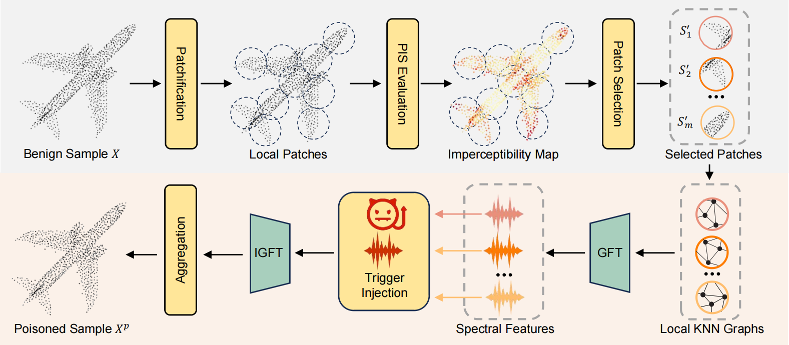
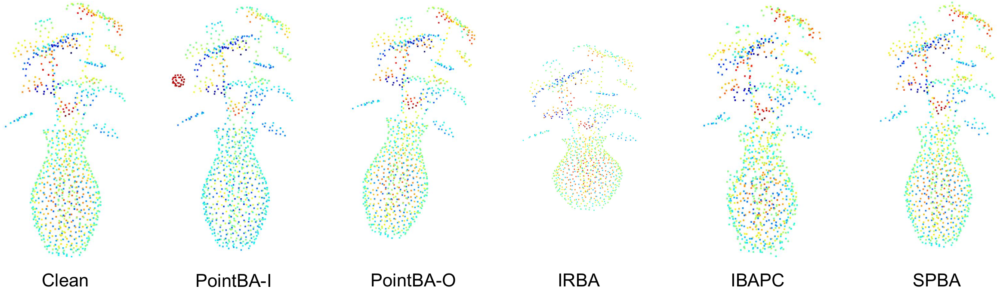

# Stealthy Patch-Wise Backdoor Attack in 3D Point Cloud via Curvature Awareness
## Method
We propose the Stealthy Patch-Wise Backdoor Attack (SPBA), the first patch-wise backdoor attack framework for 3D point clouds. Specifically, SPBA decomposes point clouds into local patches and employs a curvature-based imperceptibility score to guide trigger injection into visually less sensitive patches. By optimizing a unified patch-wise trigger that perturbs spectral features of selected patches, SPBA significantly enhances optimization efficiency while maintaining high stealthiness.


## Requirements

* Install required python packages:

```
  conda create -y -n SPBA python=3.10
  conda activate SPBA
  pip install torch==2.1.0 torchvision==0.16.0 torchaudio==2.1.0 --index-url https://download.pytorch.org/whl/cu121
  pip uninstall numpy
  conda install  https://anaconda.org/pytorch3d/pytorch3d/0.7.8/download/linux-64/pytorch3d-0.7.8-py310_cu121_pyt210.tar.bz2
  pip install requirements.txt
  pip install --upgrade https://github.com/unlimblue/KNN_CUDA/releases/download/0.2/KNN_CUDA-0.2-py3-none-any.whl
```


* Download the [ModelNet](https://www.kaggle.com/datasets/chenxaoyu/modelnet-normal-resampled?resource=download) and [Shapenet](https://www.kaggle.com/datasets/mitkir/shapenet) datasets (dat files) in `./data` folder. And rename them as `./data/modelnet40_normal_resampled` and `./data/shapenetcore_partanno_segmentation_benchmark_v0_normal/`.


## Training


> CUDA_VISIBLE_DEVICES=0 python backdoor_attack.py --seed 0 --name SPBA --L2_weight 1 --chamfer_weight 10 --Hausdorff_weight 1 --patch_size 32 --topk 16 --model pointnet2_cls' 

* name: The name of the experiment.

* L2_weight: The weight of L2 loss.

* chamfer_weight: The weight of the chamfer loss.

* Hausdorff_weight: The weight of the Hausdorff loss.

* patch_size: The size of the decomposed patches.

* topk: The number of the selected patches.

* model: The model used in training.


  The experiment files will be saved in a folder named by timestamp under the path `./log/modelnet40_pointnet2_cls/SPBA/` 

## Test

> CUDA_VISIBLE_DEVICES=0 python backdoor_attack_test.py --target_model ./log/modelnet40_pointnet2_cls/SPBA/XX-XX-XX --model DGCNN_cls'

* target_model: The path of the expermnet folder.
* model: The model used in training.

## Citation
```
@article{feng2025stealthy,
  title={Stealthy Patch-Wise Backdoor Attack in 3D Point Cloud via Curvature Awareness},
  author={Feng, Yu and Zhang, Dingxin and Zhao, Runkai and Xia, Yong and Huang, Heng and Cai, Weidong},
  journal={arXiv preprint arXiv:2503.09336},
  year={2025}
}
```

## Acknowledgements
This rpoject is based on [IRBA](https://github.com/KuofengGao/IRBA) and [IBAPC](https://github.com/f-lk/IBAPC). Thanks for their wonderful works.